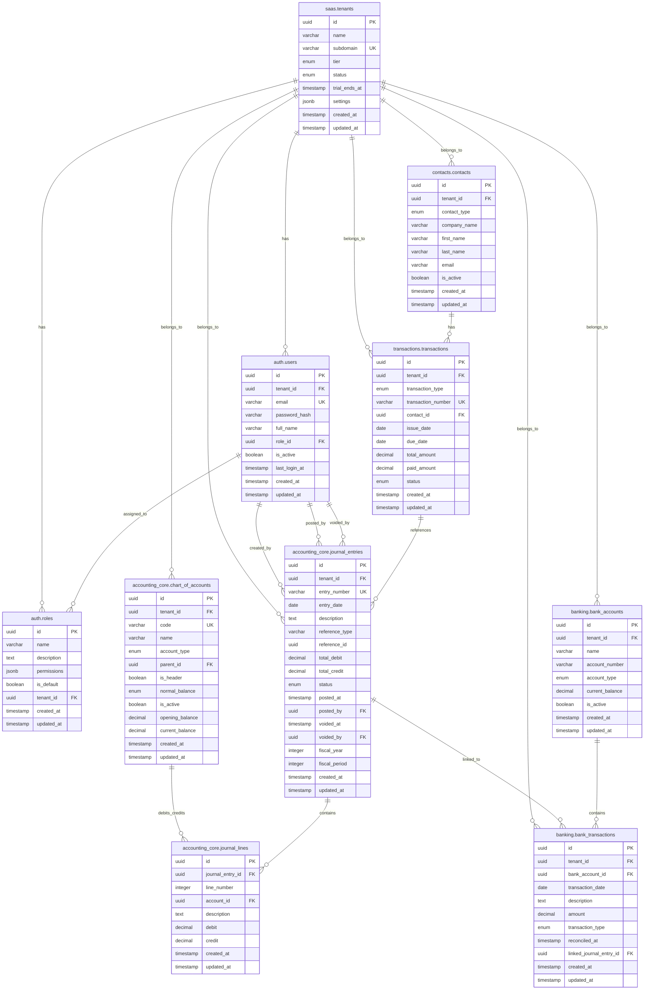

# Database Schema Specification

## Overview

This document outlines the comprehensive database schema for the Accounting AI SaaS application, designed with PostgreSQL 15+ to handle multi-tenant accounting requirements with robust security, audit trails, and performance optimization.

## Technology Stack

- **Database**: PostgreSQL 15+
- **Why PostgreSQL**: ACID compliance, JSONB support, advanced indexing, proven for financial data
- **Primary Keys**: UUID for security and distributed systems
- **Multi-tenancy**: Row-level security via tenant_id
- **Audit Trail**: Created/updated timestamps and user tracking
- **Data Integrity**: Foreign key constraints and check constraints

## Schema Organization

```
accounting_core     - Chart of accounts, journals, ledger
transactions        - Invoices, bills, payments
banking             - Bank accounts, reconciliation
contacts            - Customers, vendors, employees
auth                - Users, roles, permissions
audit               - Activity logs, change history
ai                  - ML models, classifications, predictions
saas                - Tenants, subscriptions, billing
```

## Core Tables

### 1. SAAS Tenants (Multi-tenancy foundation)

```sql
CREATE TABLE saas.tenants (
  id UUID PRIMARY KEY DEFAULT gen_random_uuid(),
  name VARCHAR(255) NOT NULL,
  subdomain VARCHAR(63) UNIQUE NOT NULL,
  tier ENUM('starter', 'professional', 'enterprise') NOT NULL,
  status ENUM('active', 'suspended', 'trial') DEFAULT 'trial',
  trial_ends_at TIMESTAMP,
  settings JSONB DEFAULT '{}',
  deleted_at TIMESTAMP,
  created_at TIMESTAMP DEFAULT NOW(),
  updated_at TIMESTAMP DEFAULT NOW(),
  created_by UUID,
  updated_by UUID
);

-- Indexes
CREATE INDEX idx_tenants_subdomain ON saas.tenants(subdomain);
CREATE INDEX idx_tenants_status ON saas.tenants(status);
CREATE INDEX idx_tenants_deleted_at ON saas.tenants(deleted_at);

-- Triggers for audit
CREATE TRIGGER trigger_tenants_updated_at
BEFORE UPDATE ON saas.tenants
FOR EACH ROW EXECUTE FUNCTION update_updated_at();
```

### 2. Authentication and Authorization

```sql
-- Roles table
CREATE TABLE auth.roles (
  id UUID PRIMARY KEY DEFAULT gen_random_uuid(),
  name VARCHAR(100) NOT NULL,
  description TEXT,
  permissions JSONB DEFAULT '[]',
  is_default BOOLEAN DEFAULT FALSE,
  tenant_id UUID NOT NULL REFERENCES saas.tenants(id),
  deleted_at TIMESTAMP,
  created_at TIMESTAMP DEFAULT NOW(),
  updated_at TIMESTAMP DEFAULT NOW(),
  created_by UUID,
  updated_by UUID
);

-- Users table
CREATE TABLE auth.users (
  id UUID PRIMARY KEY DEFAULT gen_random_uuid(),
  tenant_id UUID NOT NULL REFERENCES saas.tenants(id),
  email VARCHAR(255) NOT NULL,
  password_hash VARCHAR(255) NOT NULL,
  full_name VARCHAR(255),
  role_id UUID REFERENCES auth.roles(id),
  is_active BOOLEAN DEFAULT TRUE,
  last_login_at TIMESTAMP,
  email_verified BOOLEAN DEFAULT FALSE,
  phone VARCHAR(20),
  avatar_url TEXT,
  settings JSONB DEFAULT '{}',
  deleted_at TIMESTAMP,
  created_at TIMESTAMP DEFAULT NOW(),
  updated_at TIMESTAMP DEFAULT NOW(),
  created_by UUID,
  updated_by UUID,

  UNIQUE(tenant_id, email),
  CONSTRAINT chk_email_format CHECK (email ~* '^[A-Za-z0-9._%+-]+@[A-Za-z0-9.-]+\.[A-Za-z]{2,}$')
);

-- Sessions table
CREATE TABLE auth.sessions (
  id UUID PRIMARY KEY DEFAULT gen_random_uuid(),
  user_id UUID NOT NULL REFERENCES auth.users(id) ON DELETE CASCADE,
  token_hash VARCHAR(255) NOT NULL,
  expires_at TIMESTAMP NOT NULL,
  ip_address INET,
  user_agent TEXT,
  is_active BOOLEAN DEFAULT TRUE,
  created_at TIMESTAMP DEFAULT NOW()
);

-- Indexes
CREATE INDEX idx_users_tenant ON auth.users(tenant_id);
CREATE INDEX idx_users_email ON auth.users(email);
CREATE INDEX idx_users_role ON auth.users(role_id);
CREATE INDEX idx_users_deleted_at ON auth.users(deleted_at);
CREATE INDEX idx_sessions_user ON auth.sessions(user_id);
CREATE INDEX idx_sessions_token ON auth.sessions(token_hash);
CREATE INDEX idx_sessions_expires ON auth.sessions(expires_at);

-- Triggers
CREATE TRIGGER trigger_users_updated_at
BEFORE UPDATE ON auth.users
FOR EACH ROW EXECUTE FUNCTION update_updated_at();

CREATE TRIGGER trigger_roles_updated_at
BEFORE UPDATE ON auth.roles
FOR EACH ROW EXECUTE FUNCTION update_updated_at();
```

### 3. Chart of Accounts

```sql
CREATE TABLE accounting_core.chart_of_accounts (
  id UUID PRIMARY KEY DEFAULT gen_random_uuid(),
  tenant_id UUID NOT NULL REFERENCES saas.tenants(id),
  code VARCHAR(20) NOT NULL,
  name VARCHAR(255) NOT NULL,
  account_type ENUM('asset', 'liability', 'equity', 'revenue', 'expense') NOT NULL,
  account_subtype VARCHAR(50),
  parent_id UUID REFERENCES accounting_core.chart_of_accounts(id),
  is_header BOOLEAN DEFAULT FALSE,
  normal_balance ENUM('debit', 'credit') NOT NULL,
  is_active BOOLEAN DEFAULT TRUE,
  is_system BOOLEAN DEFAULT FALSE,
  currency_code CHAR(3) DEFAULT 'USD',
  description TEXT,
  opening_balance DECIMAL(15,2) DEFAULT 0,
  current_balance DECIMAL(15,2) DEFAULT 0,
  deleted_at TIMESTAMP,
  created_at TIMESTAMP DEFAULT NOW(),
  updated_at TIMESTAMP DEFAULT NOW(),
  created_by UUID REFERENCES auth.users(id),
  updated_by UUID REFERENCES auth.users(id),

  UNIQUE(tenant_id, code),
  CONSTRAINT chk_header_no_parent CHECK (NOT (is_header = TRUE AND parent_id IS NOT NULL)),
  CONSTRAINT chk_normal_balance CHECK (normal_balance IN ('debit', 'credit')),
  CONSTRAINT chk_positive_opening_balance CHECK (opening_balance >= 0)
);

-- Indexes
CREATE INDEX idx_coa_tenant ON accounting_core.chart_of_accounts(tenant_id);
CREATE INDEX idx_coa_type ON accounting_core.chart_of_accounts(account_type);
CREATE INDEX idx_coa_parent ON accounting_core.chart_of_accounts(parent_id);
CREATE INDEX idx_coa_active ON accounting_core.chart_of_accounts(is_active);
CREATE INDEX idx_coa_deleted_at ON accounting_core.chart_of_accounts(deleted_at);

-- Triggers
CREATE TRIGGER trigger_coa_updated_at
BEFORE UPDATE ON accounting_core.chart_of_accounts
FOR EACH ROW EXECUTE FUNCTION update_updated_at();
```

### 4. Journal Entries (Double-Entry Core)

```sql
CREATE TABLE accounting_core.journal_entries (
  id UUID PRIMARY KEY DEFAULT gen_random_uuid(),
  tenant_id UUID NOT NULL REFERENCES saas.tenants(id),
  entry_number VARCHAR(50) NOT NULL,
  entry_date DATE NOT NULL,
  description TEXT,
  reference_type VARCHAR(50), -- 'invoice', 'bill', 'payment', 'manual', 'adjustment'
  reference_id UUID,
  total_debit DECIMAL(15,2) NOT NULL DEFAULT 0,
  total_credit DECIMAL(15,2) NOT NULL DEFAULT 0,
  status ENUM('draft', 'posted', 'voided') DEFAULT 'draft',
  posted_at TIMESTAMP,
  posted_by UUID REFERENCES auth.users(id),
  voided_at TIMESTAMP,
  voided_by UUID REFERENCES auth.users(id),
  void_reason TEXT,
  fiscal_year INTEGER,
  fiscal_period INTEGER,
  is_closing_entry BOOLEAN DEFAULT FALSE,
  is_adjusting_entry BOOLEAN DEFAULT FALSE,
  exchange_rate DECIMAL(10,6) DEFAULT 1.0,
  base_currency CHAR(3) DEFAULT 'USD',
  source_currency CHAR(3) DEFAULT 'USD',
  deleted_at TIMESTAMP,
  created_at TIMESTAMP DEFAULT NOW(),
  updated_at TIMESTAMP DEFAULT NOW(),
  created_by UUID REFERENCES auth.users(id),
  updated_by UUID REFERENCES auth.users(id),

  UNIQUE(tenant_id, entry_number),
  CONSTRAINT chk_balanced_entry CHECK (total_debit = total_credit),
  CONSTRAINT chk_positive_amounts CHECK (total_debit >= 0 AND total_credit >= 0),
  CONSTRAINT chk_valid_status CHECK (status IN ('draft', 'posted', 'voided'))
);

-- Indexes
CREATE INDEX idx_je_tenant ON accounting_core.journal_entries(tenant_id);
CREATE INDEX idx_je_date ON accounting_core.journal_entries(entry_date);
CREATE INDEX idx_je_status ON accounting_core.journal_entries(status);
CREATE INDEX idx_je_fiscal ON accounting_core.journal_entries(fiscal_year, fiscal_period);
CREATE INDEX idx_je_reference ON accounting_core.journal_entries(reference_type, reference_id);
CREATE INDEX idx_je_posted_by ON accounting_core.journal_entries(posted_by);
CREATE INDEX idx_je_deleted_at ON accounting_core.journal_entries(deleted_at);

-- Triggers
CREATE TRIGGER trigger_je_updated_at
BEFORE UPDATE ON accounting_core.journal_entries
FOR EACH ROW EXECUTE FUNCTION update_updated_at();

CREATE TRIGGER trigger_validate_je_balance
BEFORE INSERT OR UPDATE ON accounting_core.journal_entries
FOR EACH ROW EXECUTE FUNCTION validate_journal_balance();
```

### 5. Journal Lines

```sql
CREATE TABLE accounting_core.journal_lines (
  id UUID PRIMARY KEY DEFAULT gen_random_uuid(),
  journal_entry_id UUID NOT NULL REFERENCES accounting_core.journal_entries(id) ON DELETE CASCADE,
  line_number INTEGER NOT NULL,
  account_id UUID NOT NULL REFERENCES accounting_core.chart_of_accounts(id),
  description TEXT,
  debit DECIMAL(15,2) DEFAULT 0,
  credit DECIMAL(15,2) DEFAULT 0,
  currency_code CHAR(3) DEFAULT 'USD',
  exchange_rate DECIMAL(10,6) DEFAULT 1.0,
  tax_amount DECIMAL(15,2) DEFAULT 0,
  tax_rate DECIMAL(8,4) DEFAULT 0,
  memo TEXT,
  department_id UUID, -- Reference to departments table
  project_id UUID,    -- Reference to projects table
  created_at TIMESTAMP DEFAULT NOW(),
  updated_at TIMESTAMP DEFAULT NOW(),
  created_by UUID REFERENCES auth.users(id),
  updated_by UUID REFERENCES auth.users(id),

  CONSTRAINT chk_line_positive_amounts CHECK (debit >= 0 AND credit >= 0),
  CONSTRAINT chk_single_side_only CHECK ((debit = 0 AND credit > 0) OR (debit > 0 AND credit = 0) OR (debit = 0 AND credit = 0)),
  CONSTRAINT chk_line_number_positive CHECK (line_number > 0)
);

-- Indexes
CREATE INDEX idx_jl_entry ON accounting_core.journal_lines(journal_entry_id);
CREATE INDEX idx_jl_account ON accounting_core.journal_lines(account_id);
CREATE INDEX idx_jl_department ON accounting_core.journal_lines(department_id);
CREATE INDEX idx_jl_project ON accounting_core.journal_lines(project_id);

-- Triggers
CREATE TRIGGER trigger_jl_updated_at
BEFORE UPDATE ON accounting_core.journal_lines
FOR EACH ROW EXECUTE FUNCTION update_updated_at();
```

### 6. Contacts (Customers, Vendors, Employees)

```sql
-- Contact types enum
CREATE TYPE contact_type AS ENUM ('customer', 'vendor', 'employee');

CREATE TABLE contacts.contacts (
  id UUID PRIMARY KEY DEFAULT gen_random_uuid(),
  tenant_id UUID NOT NULL REFERENCES saas.tenants(id),
  contact_type contact_type NOT NULL,
  company_name VARCHAR(255),
  first_name VARCHAR(100),
  last_name VARCHAR(100),
  email VARCHAR(255),
  phone VARCHAR(20),
  website VARCHAR(255),
  address_line1 VARCHAR(255),
  address_line2 VARCHAR(255),
  city VARCHAR(100),
  state VARCHAR(100),
  postal_code VARCHAR(20),
  country VARCHAR(100),
  tax_id VARCHAR(50),
  payment_terms_days INTEGER DEFAULT 30,
  credit_limit DECIMAL(15,2) DEFAULT 0,
  is_active BOOLEAN DEFAULT TRUE,
  notes TEXT,
  custom_fields JSONB DEFAULT '{}',
  deleted_at TIMESTAMP,
  created_at TIMESTAMP DEFAULT NOW(),
  updated_at TIMESTAMP DEFAULT NOW(),
  created_by UUID REFERENCES auth.users(id),
  updated_by UUID REFERENCES auth.users(id)
);

-- Indexes
CREATE INDEX idx_contacts_tenant ON contacts.contacts(tenant_id);
CREATE INDEX idx_contacts_type ON contacts.contacts(contact_type);
CREATE INDEX idx_contacts_email ON contacts.contacts(email);
CREATE INDEX idx_contacts_company ON contacts.contacts(company_name);
CREATE INDEX idx_contacts_active ON contacts.contacts(is_active);
CREATE INDEX idx_contacts_deleted_at ON contacts.contacts(deleted_at);

-- Triggers
CREATE TRIGGER trigger_contacts_updated_at
BEFORE UPDATE ON contacts.contacts
FOR EACH ROW EXECUTE FUNCTION update_updated_at();
```

### 7. Transactions (Invoices, Bills, Payments)

```sql
-- Transaction types enum
CREATE TYPE transaction_type AS ENUM ('invoice', 'bill', 'payment', 'credit_note', 'debit_note');

CREATE TABLE transactions.transactions (
  id UUID PRIMARY KEY DEFAULT gen_random_uuid(),
  tenant_id UUID NOT NULL REFERENCES saas.tenants(id),
  transaction_type transaction_type NOT NULL,
  transaction_number VARCHAR(50) NOT NULL,
  contact_id UUID NOT NULL REFERENCES contacts.contacts(id),
  issue_date DATE NOT NULL,
  due_date DATE,
  currency_code CHAR(3) DEFAULT 'USD',
  subtotal DECIMAL(15,2) NOT NULL DEFAULT 0,
  tax_amount DECIMAL(15,2) DEFAULT 0,
  discount_amount DECIMAL(15,2) DEFAULT 0,
  total_amount DECIMAL(15,2) NOT NULL DEFAULT 0,
  paid_amount DECIMAL(15,2) DEFAULT 0,
  balance_due DECIMAL(15,2) GENERATED ALWAYS AS (total_amount - paid_amount) STORED,
  status ENUM('draft', 'sent', 'viewed', 'paid', 'overdue', 'partial', 'cancelled', 'disputed') DEFAULT 'draft',
  notes TEXT,
  terms TEXT,
  exchange_rate DECIMAL(10,6) DEFAULT 1.0,
  reference_number VARCHAR(50),
  reference_date DATE,
  deleted_at TIMESTAMP,
  created_at TIMESTAMP DEFAULT NOW(),
  updated_at TIMESTAMP DEFAULT NOW(),
  created_by UUID REFERENCES auth.users(id),
  updated_by UUID REFERENCES auth.users(id),

  UNIQUE(tenant_id, transaction_number),
  CONSTRAINT chk_positive_amounts CHECK (subtotal >= 0 AND tax_amount >= 0 AND discount_amount >= 0 AND total_amount >= 0)
);

CREATE TABLE transactions.transaction_items (
  id UUID PRIMARY KEY DEFAULT gen_random_uuid(),
  transaction_id UUID NOT NULL REFERENCES transactions.transactions(id) ON DELETE CASCADE,
  item_sequence INTEGER NOT NULL,
  item_name VARCHAR(255) NOT NULL,
  description TEXT,
  quantity DECIMAL(10,2) NOT NULL DEFAULT 1,
  unit_price DECIMAL(15,2) NOT NULL,
  tax_rate DECIMAL(8,4) DEFAULT 0,
  tax_amount DECIMAL(15,2) DEFAULT 0,
  total_amount DECIMAL(15,2) NOT NULL,
  account_id UUID REFERENCES accounting_core.chart_of_accounts(id),
  created_at TIMESTAMP DEFAULT NOW()
);

-- Indexes
CREATE INDEX idx_transactions_tenant ON transactions.transactions(tenant_id);
CREATE INDEX idx_transactions_type ON transactions.transactions(transaction_type);
CREATE INDEX idx_transactions_contact ON transactions.transactions(contact_id);
CREATE INDEX idx_transactions_date ON transactions.transactions(issue_date);
CREATE INDEX idx_transactions_status ON transactions.transactions(status);
CREATE INDEX idx_transactions_balance ON transactions.transactions(balance_due);
CREATE INDEX idx_transactions_deleted_at ON transactions.transactions(deleted_at);

CREATE INDEX idx_transaction_items_trans ON transactions.transaction_items(transaction_id);
CREATE INDEX idx_transaction_items_account ON transactions.transaction_items(account_id);

-- Triggers
CREATE TRIGGER trigger_transactions_updated_at
BEFORE UPDATE ON transactions.transactions
FOR EACH ROW EXECUTE FUNCTION update_updated_at();
```

### 8. Banking

```sql
CREATE TABLE banking.bank_accounts (
  id UUID PRIMARY KEY DEFAULT gen_random_uuid(),
  tenant_id UUID NOT NULL REFERENCES saas.tenants(id),
  name VARCHAR(255) NOT NULL,
  account_number VARCHAR(50),
  routing_number VARCHAR(50),
  bank_name VARCHAR(255),
  account_type ENUM('checking', 'savings', 'credit_card', 'cash', 'other') NOT NULL,
  currency_code CHAR(3) DEFAULT 'USD',
  opening_balance DECIMAL(15,2) DEFAULT 0,
  current_balance DECIMAL(15,2) DEFAULT 0,
  is_active BOOLEAN DEFAULT TRUE,
  is_reconciled BOOLEAN DEFAULT FALSE,
  last_reconciled_date DATE,
  bank_integration_id VARCHAR(100), -- For connecting to external bank APIs
  deleted_at TIMESTAMP,
  created_at TIMESTAMP DEFAULT NOW(),
  updated_at TIMESTAMP DEFAULT NOW(),
  created_by UUID REFERENCES auth.users(id),
  updated_by UUID REFERENCES auth.users(id)
);

CREATE TABLE banking.bank_transactions (
  id UUID PRIMARY KEY DEFAULT gen_random_uuid(),
  tenant_id UUID NOT NULL REFERENCES saas.tenants(id),
  bank_account_id UUID NOT NULL REFERENCES banking.bank_accounts(id),
  transaction_date DATE NOT NULL,
  description TEXT NOT NULL,
  amount DECIMAL(15,2) NOT NULL,
  currency_code CHAR(3) DEFAULT 'USD',
  transaction_type ENUM('debit', 'credit') NOT NULL,
  category VARCHAR(100),
  reference_number VARCHAR(50),
  reconciled_at TIMESTAMP,
  reconciled_by UUID REFERENCES auth.users(id),
  linked_journal_entry_id UUID REFERENCES accounting_core.journal_entries(id),
  imported_from VARCHAR(50), -- 'csv', 'qif', 'ofx', 'api', 'manual'
  deleted_at TIMESTAMP,
  created_at TIMESTAMP DEFAULT NOW(),
  updated_at TIMESTAMP DEFAULT NOW(),
  created_by UUID REFERENCES auth.users(id),
  updated_by UUID REFERENCES auth.users(id)
);

-- Indexes
CREATE INDEX idx_bank_accounts_tenant ON banking.bank_accounts(tenant_id);
CREATE INDEX idx_bank_accounts_type ON banking.bank_accounts(account_type);
CREATE INDEX idx_bank_accounts_active ON banking.bank_accounts(is_active);

CREATE INDEX idx_bank_transactions_tenant ON banking.bank_transactions(tenant_id);
CREATE INDEX idx_bank_transactions_account ON banking.bank_transactions(bank_account_id);
CREATE INDEX idx_bank_transactions_date ON banking.bank_transactions(transaction_date);
CREATE INDEX idx_bank_transactions_reconciled ON banking.bank_transactions(reconciled_at);
CREATE INDEX idx_bank_transactions_linked ON banking.bank_transactions(linked_journal_entry_id);

-- Triggers
CREATE TRIGGER trigger_bank_accounts_updated_at
BEFORE UPDATE ON banking.bank_accounts
FOR EACH ROW EXECUTE FUNCTION update_updated_at();

CREATE TRIGGER trigger_bank_transactions_updated_at
BEFORE UPDATE ON banking.bank_transactions
FOR EACH ROW EXECUTE FUNCTION update_updated_at();
```

### 9. AI/ML Models and Predictions

```sql
CREATE TABLE ai.ml_models (
  id UUID PRIMARY KEY DEFAULT gen_random_uuid(),
  tenant_id UUID REFERENCES saas.tenants(id),
  model_name VARCHAR(255) NOT NULL,
  model_type VARCHAR(50) NOT NULL, -- 'classification', 'prediction', 'clustering'
  version VARCHAR(20) NOT NULL,
  training_data_size BIGINT,
  accuracy_score DECIMAL(5,4),
  created_at TIMESTAMP DEFAULT NOW(),
  updated_at TIMESTAMP DEFAULT NOW(),
  trained_by UUID REFERENCES auth.users(id),
  model_config JSONB DEFAULT '{}',
  model_artifact BYTEA -- Serialized model
);

CREATE TABLE ai.predictions (
  id UUID PRIMARY KEY DEFAULT gen_random_uuid(),
  tenant_id UUID NOT NULL REFERENCES saas.tenants(id),
  ml_model_id UUID NOT NULL REFERENCES ai.ml_models(id),
  input_data JSONB NOT NULL,
  prediction_result JSONB NOT NULL,
  confidence_score DECIMAL(5,4),
  is_correct BOOLEAN, -- For feedback loop
  feedback TEXT,      -- User feedback on prediction
  created_at TIMESTAMP DEFAULT NOW(),
  created_by UUID REFERENCES auth.users(id)
);

-- Indexes
CREATE INDEX idx_ml_models_tenant ON ai.ml_models(tenant_id);
CREATE INDEX idx_predictions_tenant ON ai.predictions(tenant_id);
CREATE INDEX idx_predictions_model ON ai.predictions(ml_model_id);
```

### 10. Audit Log

```sql
CREATE TABLE audit.activity_log (
  id UUID PRIMARY KEY DEFAULT gen_random_uuid(),
  tenant_id UUID NOT NULL REFERENCES saas.tenants(id),
  user_id UUID REFERENCES auth.users(id),
  action VARCHAR(100) NOT NULL, -- 'create', 'update', 'delete', 'login', 'logout'
  entity_type VARCHAR(50) NOT NULL, -- 'journal_entry', 'contact', 'transaction'
  entity_id UUID,
  old_values JSONB,
  new_values JSONB,
  ip_address INET,
  user_agent TEXT,
  created_at TIMESTAMP DEFAULT NOW()
);

CREATE TABLE audit.change_history (
  id UUID PRIMARY KEY DEFAULT gen_random_uuid(),
  tenant_id UUID NOT NULL REFERENCES saas.tenants(id),
  table_name VARCHAR(50) NOT NULL,
  record_id UUID NOT NULL,
  column_name VARCHAR(50) NOT NULL,
  old_value TEXT,
  new_value TEXT,
  changed_by UUID REFERENCES auth.users(id),
  change_type ENUM('INSERT', 'UPDATE', 'DELETE') NOT NULL,
  created_at TIMESTAMP DEFAULT NOW()
);

-- Indexes
CREATE INDEX idx_activity_log_tenant ON audit.activity_log(tenant_id);
CREATE INDEX idx_activity_log_user ON audit.activity_log(user_id);
CREATE INDEX idx_activity_log_action ON audit.activity_log(action);
CREATE INDEX idx_activity_log_entity ON audit.activity_log(entity_type, entity_id);
CREATE INDEX idx_activity_log_time ON audit.activity_log(created_at);

CREATE INDEX idx_change_history_tenant ON audit.change_history(tenant_id);
CREATE INDEX idx_change_history_record ON audit.change_history(table_name, record_id);
CREATE INDEX idx_change_history_time ON audit.change_history(created_at);
```

### 11. Subscriptions and Billing

```sql
CREATE TABLE saas.subscriptions (
  id UUID PRIMARY KEY DEFAULT gen_random_uuid(),
  tenant_id UUID NOT NULL REFERENCES saas.tenants(id),
  plan_id VARCHAR(50) NOT NULL,
  status ENUM('active', 'cancelled', 'past_due', 'trialing', 'unpaid') NOT NULL,
  current_period_start TIMESTAMP NOT NULL,
  current_period_end TIMESTAMP NOT NULL,
  cancel_at_period_end BOOLEAN DEFAULT FALSE,
  cancelled_at TIMESTAMP,
  created_at TIMESTAMP DEFAULT NOW(),
  updated_at TIMESTAMP DEFAULT NOW()
);

CREATE TABLE saas.invoice_items (
  id UUID PRIMARY KEY DEFAULT gen_random_uuid(),
  invoice_id UUID NOT NULL REFERENCES saas.invoices(id),
  description TEXT NOT NULL,
  quantity DECIMAL(10,2) NOT NULL,
  unit_amount DECIMAL(15,2) NOT NULL,
  total_amount DECIMAL(15,2) NOT NULL,
  created_at TIMESTAMP DEFAULT NOW()
);

CREATE TABLE saas.invoices (
  id UUID PRIMARY KEY DEFAULT gen_random_uuid(),
  tenant_id UUID NOT NULL REFERENCES saas.tenants(id),
  subscription_id UUID REFERENCES saas.subscriptions(id),
  invoice_number VARCHAR(50) NOT NULL,
  status ENUM('draft', 'open', 'paid', 'uncollectible', 'void') DEFAULT 'draft',
  amount_due DECIMAL(15,2) NOT NULL,
  amount_paid DECIMAL(15,2) DEFAULT 0,
  currency CHAR(3) DEFAULT 'USD',
  issued_date DATE NOT NULL,
  due_date DATE,
  paid_at TIMESTAMP,
  created_at TIMESTAMP DEFAULT NOW(),
  UNIQUE(tenant_id, invoice_number)
);

-- Indexes
CREATE INDEX idx_subscriptions_tenant ON saas.subscriptions(tenant_id);
CREATE INDEX idx_subscriptions_status ON saas.subscriptions(status);
CREATE INDEX idx_invoices_tenant ON saas.invoices(tenant_id);
CREATE INDEX idx_invoices_subscription ON saas.invoices(subscription_id);
CREATE INDEX idx_invoices_status ON saas.invoices(status);
```

## Database Functions and Triggers

### 1. Auto-update timestamp function

```sql
CREATE OR REPLACE FUNCTION update_updated_at()
RETURNS TRIGGER AS $$
BEGIN
  NEW.updated_at = NOW();
  RETURN NEW;
END;
$$ LANGUAGE plpgsql;
```

### 2. Journal balance validation function

```sql
CREATE OR REPLACE FUNCTION validate_journal_balance()
RETURNS TRIGGER AS $$
DECLARE
  v_debit DECIMAL(15,2);
  v_credit DECIMAL(15,2);
BEGIN
  -- Calculate totals from journal lines
  SELECT COALESCE(SUM(debit), 0), COALESCE(SUM(credit), 0)
  INTO v_debit, v_credit
  FROM accounting_core.journal_lines
  WHERE journal_entry_id = NEW.id;

  -- Check if balanced
  IF v_debit != v_credit THEN
    RAISE EXCEPTION 'Journal entry out of balance: debit=%, credit=%', v_debit, v_credit;
  END IF;

  -- Update totals in the journal entry
  NEW.total_debit := v_debit;
  NEW.total_credit := v_credit;

  RETURN NEW;
END;
$$ LANGUAGE plpgsql;
```

### 3. Account balance update function

```sql
CREATE OR REPLACE FUNCTION update_account_balance()
RETURNS TRIGGER AS $$
DECLARE
  v_account_id UUID;
  v_debit_amount DECIMAL(15,2);
  v_credit_amount DECIMAL(15,2);
  v_new_balance DECIMAL(15,2);
  v_normal_balance VARCHAR(10);
BEGIN
  -- Determine which account and amounts were affected
  IF TG_OP = 'INSERT' THEN
    v_account_id := NEW.account_id;
    v_debit_amount := NEW.debit;
    v_credit_amount := NEW.credit;
  ELSIF TG_OP = 'UPDATE' THEN
    -- Handle updates by calculating difference
    v_account_id := NEW.account_id;
    v_debit_amount := NEW.debit - OLD.debit;
    v_credit_amount := NEW.credit - OLD.credit;
  ELSIF TG_OP = 'DELETE' THEN
    v_account_id := OLD.account_id;
    v_debit_amount := -OLD.debit;
    v_credit_amount := -OLD.credit;
  END IF;

  -- Get normal balance type for the account
  SELECT normal_balance INTO v_normal_balance
  FROM accounting_core.chart_of_accounts
  WHERE id = v_account_id;

  -- Calculate new balance based on normal balance type
  IF v_normal_balance = 'debit' THEN
    v_new_balance := COALESCE((SELECT current_balance FROM accounting_core.chart_of_accounts WHERE id = v_account_id), 0) + v_debit_amount - v_credit_amount;
  ELSE
    v_new_balance := COALESCE((SELECT current_balance FROM accounting_core.chart_of_accounts WHERE id = v_account_id), 0) + v_credit_amount - v_debit_amount;
  END IF;

  -- Update the account's current balance
  UPDATE accounting_core.chart_of_accounts
  SET current_balance = v_new_balance
  WHERE id = v_account_id;

  IF TG_OP = 'INSERT' THEN
    RETURN NEW;
  ELSIF TG_OP = 'UPDATE' THEN
    RETURN NEW;
  ELSIF TG_OP = 'DELETE' THEN
    RETURN OLD;
  END IF;
END;
$$ LANGUAGE plpgsql;

-- Trigger for account balance updates
CREATE TRIGGER trigger_update_account_balance
AFTER INSERT OR UPDATE OR DELETE ON accounting_core.journal_lines
FOR EACH ROW EXECUTE FUNCTION update_account_balance();
```

## Entity Relationship Diagram



## Index Strategy

### Primary Indexes
- All foreign key columns have indexes for join performance
- Tenant isolation indexes on all tenant-scoped tables
- Status and date columns for common filtering queries

### Performance Indexes
- Composite indexes for frequently queried column combinations
- Partial indexes for active records only (`WHERE is_active = true`)
- Expression indexes for computed fields
- GIN indexes for JSONB columns

### Sample Indexes
```sql
-- Tenant isolation
CREATE INDEX CONCURRENTLY idx_journal_entries_tenant_active ON accounting_core.journal_entries(tenant_id) WHERE deleted_at IS NULL;

-- Date range queries
CREATE INDEX CONCURRENTLY idx_journal_entries_date_range ON accounting_core.journal_entries(entry_date DESC, tenant_id);

-- Status-based queries
CREATE INDEX CONCURRENTLY idx_transactions_status_active ON transactions.transactions(status, tenant_id) WHERE deleted_at IS NULL AND status IN ('open', 'overdue');

-- Full-text search
CREATE INDEX CONCURRENTLY idx_journal_entries_search ON accounting_core.journal_entries USING gin(to_tsvector('english', description));
```

## Partitioning Plan

### Future Partitioning Strategy
- **Time-based partitioning** for audit logs and activity logs
- **Tenant-based partitioning** for large tenants (when exceeding 1M records)
- **Financial year partitioning** for journal entries

### Example Partitioning
```sql
-- Example for audit logs partitioning
CREATE TABLE audit.activity_log_base PARTITION BY RANGE (created_at);

CREATE TABLE audit.activity_log_2024 PARTITION OF audit.activity_log_base
FOR VALUES FROM ('2024-01-01') TO ('2025-01-01');

CREATE TABLE audit.activity_log_2025 PARTITION OF audit.activity_log_base
FOR VALUES FROM ('2025-01-01') TO ('2026-01-01');
```

## Security and Access Control

### Row-Level Security (RLS)
```sql
-- Enable RLS on tenant-scoped tables
ALTER TABLE accounting_core.chart_of_accounts ENABLE ROW LEVEL SECURITY;
ALTER TABLE accounting_core.journal_entries ENABLE ROW LEVEL SECURITY;
ALTER TABLE contacts.contacts ENABLE ROW LEVEL SECURITY;

-- Create policies for tenant isolation
CREATE POLICY tenant_isolation_policy ON accounting_core.chart_of_accounts
USING (tenant_id = current_setting('app.current_tenant')::UUID);

CREATE POLICY tenant_isolation_policy ON accounting_core.journal_entries
USING (tenant_id = current_setting('app.current_tenant')::UUID);

CREATE POLICY tenant_isolation_policy ON contacts.contacts
USING (tenant_id = current_setting('app.current_tenant')::UUID);
```

### Application Configuration
- Set `app.current_tenant` in application connection initialization
- Use prepared statements to prevent SQL injection
- Encrypt sensitive data at rest using pgcrypto

## Backup and Restore Considerations

### Backup Strategy
- **Logical backups** using pg_dump for point-in-time recovery
- **WAL archiving** for continuous backup
- **Daily full backups** with incremental WAL backups
- **Cross-region replication** for disaster recovery

### Restore Procedures
- Test restores regularly in staging environment
- Document dependencies between tables
- Plan for schema evolution during restores

### Maintenance Jobs
```sql
-- Auto-vacuum settings for accounting data
ALTER TABLE accounting_core.journal_entries SET (autovacuum_vacuum_scale_factor = 0.05);
ALTER TABLE accounting_core.journal_lines SET (autovacuum_vacuum_scale_factor = 0.05);
```

## Migration Strategy

### Versioned Migrations
- Sequential numbered migration files
- Up/down migration scripts for rollbacks
- Automated testing of migrations
- Zero-downtime deployment patterns

### Migration Example
```sql
-- V001__initial_schema.sql
-- V002__add_audit_columns.sql
-- V003__add_indexes.sql
-- V004__enable_rls.sql
```

## Performance Optimization

### Query Optimization
- Use EXPLAIN ANALYZE for slow query identification
- Implement read replicas for reporting queries
- Cache frequently accessed data in application layer
- Monitor query patterns and optimize accordingly

### Connection Management
- Use connection pooling (PgBouncer)
- Optimize PostgreSQL configuration for workload
- Monitor connection usage and scale accordingly

This comprehensive schema provides a solid foundation for a multi-tenant accounting SaaS application with proper security, audit trails, and performance considerations.